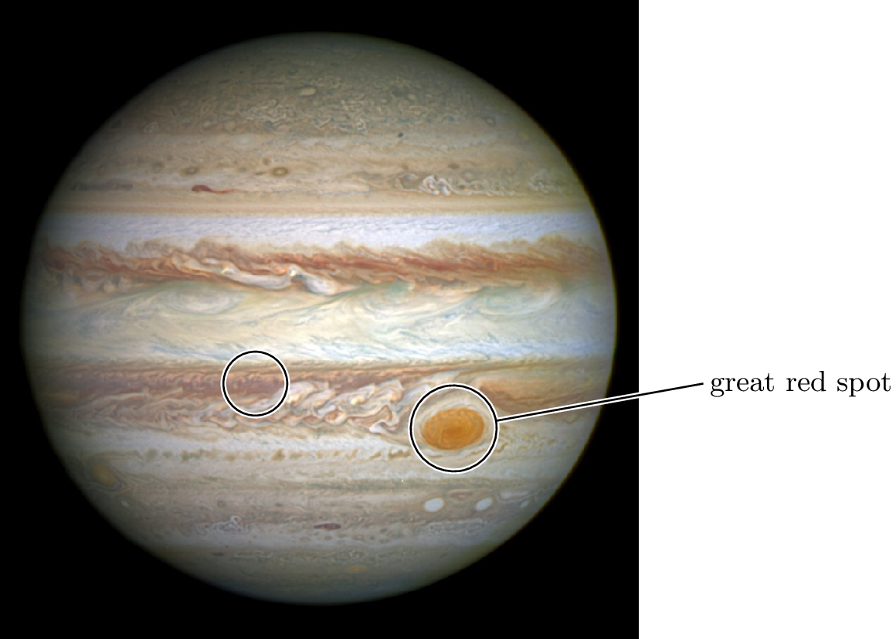
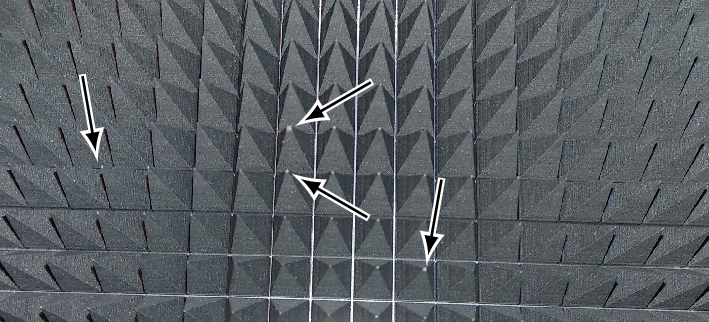

# imagelabels

Image labeling/annotations with TikZ

## What is it good for?

Often, one needs to put labels onto a photograph to...
* describe things
* mark certain details.

This LaTeX package simplifies this job. It allows to produce images with labels
as shown in these examples:





## How to use it

Just create a new LaTeX document with the following skeleton:

```
\documentclass{standalone}
\usepackage{imagelabels}

\begin{document}
  \begin{annotationimage}{<size>}{<filename>}
    <put your code here>
  \end{annotationimage}
\end{document}
```

The `<size>` is used to scale the image file. `<size>` may be empty or one of
`width=` or `height=`. Example: `width=6cm`

The `<filename>` parameter is the actual image file used.

To find the coordinates of the points to be labelled, a help grid can be
displayed. The help grid is enabled with the `\helpgrid` command, as follows:

```
\documentclass{standalone}
\usepackage{imagelabels}

% put the \helpgrid command anywhere before the annotationimage
\helpgrid

\begin{document}
  \begin{annotationimage}{<size>}{<filename>}
    <put your code here>
  \end{annotationimage}
\end{document}
```

This results in the following image:


## Labelling points

Now, one can place the annotation arrows by using the four commands
`\labelleft`, `\labelabove`, `\labelright` and `\labelbelow`. They put the
labels left, above, right or below of the image, respectively. Parameters are
as follows:

`\label<orientation>{<point>}{<label text>}{<label position>}`

* The orientation is one of `left`, `above`, `right` or `below`.
* The `<point>` is the coordinate of the point to be labelled. The coordinates
  are easily determined with the aid of the help grid.
* `<label text>` is the text of the label.
* `<label position>` indicates the position where the label will be placed.
  E.g. if the label is on the left of the image, the `<position>` specifies the
  height at which the label will be positioned. The same is the case for a label
  being positioned on the right of the image. If the label is above or below of
  the image, the `<position>` indicates the width where the label will be.

## Marking points

Sometimes one doesn't want to label points, but put just a marking arrow. This
can be done with the `\marking` command. It takes 3 arguments:

`\marking{<x pos>}{<y pos>}{<angle>}`

* the `<x pos>` and `<y pos>` are the point to be marked, and can, again, be
  determined using the help grid.
* the `<angle>` is in degrees and indicates the tilt of the arrow. 0 degrees is
  at 3 o'clock.

The marking arrows are all of the same size. Further, the arrow is automatically
slightly offset from the point given, such that the arrow tip does not cover the
coordinate the arrow is pointing at.

## Labelling an image

If one just wants to put a label to an image, the command `\imagelabel` may be
used. It takes just one parameter which is the label. The label is automatically
positioned on the bottom right and has a black background and white font.
